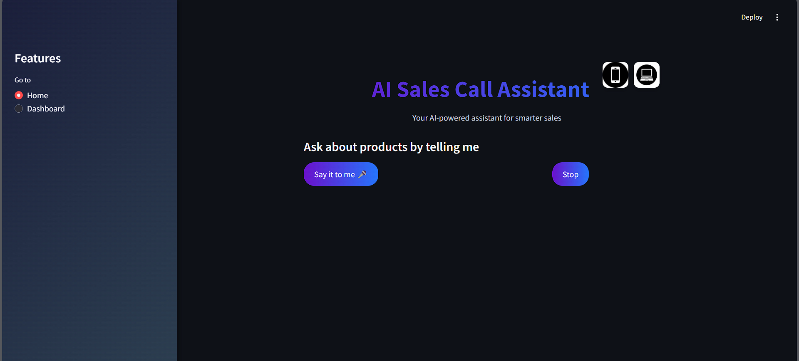

## 🧠 Real_Time_AI_Sales_Call_Assistant

Welcome to the **Real Time AI Sales Call Assistant** project! This application is a production recommendation system with the capability to handle objections, generate questions and analyze the conversation for improvement of Sales Calls in real time using advance AI models. Built with streamlit, this tool offers a seamless and interactive user experience.



## 🚀 Features
- **🎙️ Real-time voice transcription and analysis**
- **🤖 Dynamic question and objection handling**
- **🔧 Personalized product recommendations**
- **📊 Historical data insights for optimized strategies**
- **🖥️ Easy-to-use interface with Streamlit implementation**

## 🛠️ Installation

Follow these steps to set up the project locally:


1. **🔀 Clone the Repository:**
```bash
git clone https://github.com/Divyanshu671/Sales_Call_Assistant.git
```
```bash
cd Sales_Call_Assistant
```

2. **📥 Install Required System Dependencies:**

   > **⚠️ Python Compatibility**: This project requires Python version 3.11. 

   **Version Notes:**
   - ✅ Python 3.11: Compatible and some packages might need for additional setup

   First, ensure you have the correct Python version:
   ```Command Prompt
   # check Python version
   python --version  # Windows
   python3 --version  # macOS/Linux
   ```

   **Windows:**
   ```Command Prompt
   # Install Python 3.11 if needed
   winget install Python.Python.3.11

   # Create virtual environment with Python
   python -m venv venv

   # Activate virtual environment
   venv\Scripts\activate

   # Upgrade pip
   python -m pip install --upgrade pip

   # Verify Python version
   python --version  # Should show Python 3.11.x
   ```

   **macOS/Linux:**
   ```bash
   # Install Python 3.11 if needed
   brew install python@3.11
   
   # Create virtual environment with Python 3.11
   python3.11 -m venv venv
   
   # Activate virtual environment
   source venv/bin/activate
   
   # Upgrade pip
   pip3 install --upgrade pip
   
   # Verify Python version
   python3 --version  # Should show Python 3.11.x
   ```


   If you have multiple Python versions installed, you can also use these alternative paths:
   ```bash
   # Windows alternative
   C:\Python311\python -m venv venv
   
   # macOS alternative (Intel)
   /usr/local/opt/python@3.11/bin/python3.11 -m venv venv
   
   # macOS alternative (Apple Silicon)
   /opt/homebrew/opt/python@3.11/bin/python3.11 -m venv venv
   ```

   If you encounter any PyTorch-related errors:
   1. Visit [PyTorch Get Started](https://pytorch.org/get-started/locally/)
   2. Select your operating system and preferences
   3. Use the provided installation command before installing other requirements

   **macOS:**
   
   First, install Homebrew if you haven't already:
   ```bash
   # Install Homebrew
   /bin/bash -c "$(curl -fsSL https://raw.githubusercontent.com/Homebrew/install/HEAD/install.sh)"
   
   # After installation, add Homebrew to your PATH:
   # For Intel Macs
   echo 'eval "$(/usr/local/bin/brew shellenv)"' >> ~/.zshrc
   # For Apple Silicon Macs
   echo 'eval "$(/opt/homebrew/bin/brew shellenv)"' >> ~/.zshrc
   
   # Reload your shell configuration
   source ~/.zshrc
   ```

   Then install the required dependencies:
   ```bash
   # Install openssl or zlib
   brew install openssl zlib
   
   ```

3. **📦 Install Dependencies:**

```bash
pip install -r requirements.txt
```

4. **🔑 Generate GROQ API key:**

##
- Go to Groq's website: https://groq.com/
- Go to the API or Developer Dashboard section of the platform. This is where you'll be able to generate and manage API keys.
- Once generated, copy the API key and store it in **.env** file as **GROQ_API_KEY=you_groq_api_key** inside project directory.
##

5. **🚀 Run the Application**

```bash
streamlit run app.py
```

## 💻 usage

Once the application starts, follow these steps:

1. **🎤 Start Recording:**
    - Navigate to Home menu from the sidebar and press on Say it to me button and stop the coversation by clicking on Stop button

2. **🔍 Preview the the output:**
    - After each conversation recording the the application will show text regarding products you asked about

3. **📑 Give Recommendation and Response:**
    - The app will automatically transcribe your words and analyze the sentiments based on them app will recommend products if products available are available and show objections.

4. **📝 Summarize all the conversation:**
    - Generate a combined summary based on all previous conversations.

## 📁 Project Structure

Sales_Call_Assistant/

├── app.py           
├── requirements.txt            
├── packages.txt            
├── utils/      
|  ├── audio_processing.py      
|  ├── crmd_system.py      
|  ├── sentiment_analyzing.py      
|  └── storing_conversations.py\
├── README.md         
└── data/
   ─── icons\
   └── available_products

- **`app.py`**: The main Streamlit application file.
- **`requirements.txt`**: Lists all the project dependencies.
- **`utils/`**: Contains utility modules for internal processing and summarization.
- **`data/`**: Directory where the images, products data and other assets are stored.

## 🧰 Dependencies

The project relies on the following key libraries:

- **[Streamlit](https://streamlit.io/):** For building the interactive web application.
- **[Sounddevice](https://pypi.org/project/sounddevice/):** For real time audio input
- **[Groq-Whisper](https://github.com/openai/whisper):** For audio file transcription
- **[Pydub](https://pypi.org/project/pydub/):** For sentiment analysis of tone of user
- **[NLTK](https://pypi.org/project/nltk/):** For sentiment analysis of text
- **[Spacy](https://pypi.org/project/spacy/):** For coverting text to word vectors for faiss
- **[Faiss-cpu](https://pypi.org/project/faiss-cpu/):** For the RAG implementation to recommend products
- **[Groq](https://github.com/groq/groq-python):** For objection handling
- **[Pandas](https://pandas.pydata.org/):** For data manipulation and analysis.
- **[Plotly](https://plotly.com/python/):** For pictorial representation of data insights
- **[Fpdf](https://pypi.org/project/fpdf/):** For generating and handling PDF files.


**Full List of Dependencies:**

Streamlit
Sounddevice
Groq-Whisper
Pydub
NLTK
Spacy
Faiss-cpu
Groq
Pandas
Plotly
Fpdf

## 📄 Agile Documentation

For detailed sprint planning and Agile-related documentation, refer to the [Agile Sprint Plan](docs/Real_Time_AI_Sales_Call_Assistant.docx).

## 📝 License

This project is licensed under the [License](LICENSE.txt).

## 📧 Contact

For any inquiries or feedback, please reach out to [Divyanshu Tripathi](divyanshutripathi321@gmail.com).

---

<div align="center">
  <!--   -->
   
  
  
</div>
